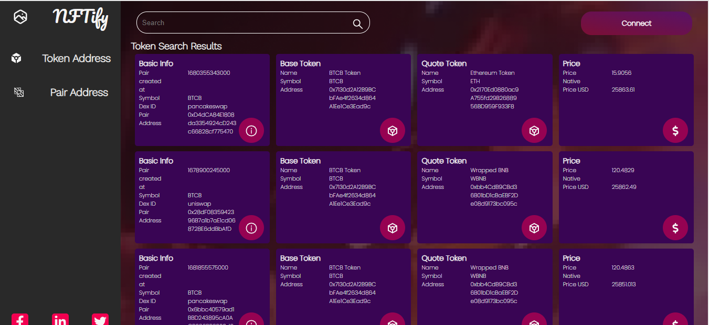

# DexScreener API Integration Project


## Table of Contents
- [Introduction](#introduction)
- [API Integration](#api-integration)
- [User Interface](#user-interface)
- [Tech Stack](#tech-stack)
- [Getting Started](#getting-started)
- [Usage](#usage)
- [Search Functionality](#search-functionality)
- [Data Fetching](#data-fetching)
- [Limitations](#limitations)

## Introduction
This project aims to create a web application that integrates with the DexScreener API to provide users with real-time data on decentralized exchange (DEX) pairs and tokens. Users can search for pairs or token addresses and receive detailed information about them.

## API Integration
We utilize the following endpoints from the DexScreener API:
- `GET https://api.dexscreener.com/latest/dex/tokens/:tokenAddresses`
- `GET https://api.dexscreener.com/latest/dex/search/?q=:query`
Please refer to the [DexScreener API Reference](https://docs.dexscreener.com/api/reference) for detailed information on these endpoints.

## User Interface
The project's user interface has been designed according to the specifications provided in Figma. 

## Tech Stack
- **React.js**: Front-end library for building user interfaces.
- **Vanilla CSS**: Custom styling for the user interface.

## Getting Started
To run this project locally, follow these steps:
1. Clone this repository to your local machine.
2. Navigate to the project directory.
3. Install dependencies using your preferred package manager (e.g., npm or yarn).
4. Start the development server.
```bash
git clone https://github.com/NehaP0/matrixLabs.git
cd matrixLabs
npm install
npm start
```

## Usage
Users can access the web application through their browsers. Upon loading, they will be presented with a user-friendly interface to interact with the DexScreener API.

## Search Functionality
- Users can input either a pair or token address in the search bar.
- The application will make calls to the DexScreener API to fetch the relevant data.
- Results will be displayed on the interface, providing detailed information about the pair/token.

## Data Fetching
All data required for the website is fetched dynamically from the DexScreener API. The application handles the fetching and rendering of data according to user input.

## Limitations

Please note the following limitations:
-The application relies on the availability and reliability of the DexScreener API. Any downtime or changes to the API may affect functionality.
-The project's search functionality is designed for specific use cases and may not cover all possible scenarios.
